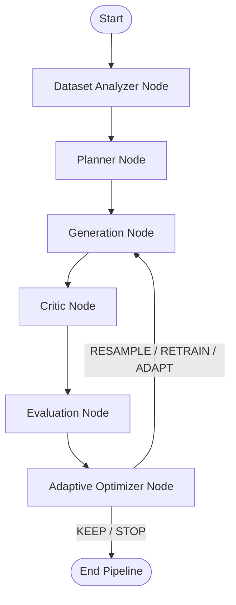

# GenForge-AI ⚡
> **Autonomous Synthetic Data Generation & ML Experiment Optimization Framework with Cyclic LangGraph Orchestration**

---

## 📌 Overview

**GenForge-AI** is an end-to-end framework designed to solve dataset imbalances, augment training data, and intelligently orchestrate generative models (CVAE, DCGAN, cDCGAN). Powered by **LangGraph cyclic workflows** and an **Adaptive Optimizer**, GenForge-AI autonomously analyzes datasets, plans class-aware synthetic generation, evaluates sample quality with a critic model, and adaptively decides whether to optimize, resample, or retrain models.

---

## 🚀 Key Features

- 🧠 **Adaptive Optimizer Engine**:
  - Multi-criteria intelligent decision system (`KEEP`, `RESAMPLE`, `RETRAIN`, `ADAPT_LATENT`, `STOP`).
  - Evaluates quality scoring across synthetic accuracy, discriminator acceptance rate, and latent diversity.
  - Confidence-based improvement assessment with statistical validation.

- 🔄 **Cyclic LangGraph Orchestration**:
  - State machine pipeline with feedback loops: `Dataset Analyzer` ➔ `Planner` ➔ `Generator` ➔ `Critic` ➔ `Evaluator` ➔ `Optimizer` ➔ `Iterative Loop`.
  - Iteration safety guards preventing infinite optimization loops.

- 🎨 **Generative Architectures**:
  - **Conditional VAE (CVAE)**: Disentangled latent representation with class-conditioned generation.
  - **DCGAN & Conditional DCGAN (cDCGAN)**: High-fidelity deep convolutional generative adversarial networks.
  - Latent space diversity sampling and diagnostic visualizations.

- ⚡ **Full-Stack Application**:
  - **Backend**: High-performance FastAPI REST server for live pipeline execution, async experiment tracking, and metrics streaming.
  - **Frontend**: Modern React + Vite + Tailwind CSS dashboard with real-time pipeline visualizer, live experiment modal, interactive metrics, and dataset inspectors.

---

## 🏗️ Architecture



---

## 📂 Project Structure

```bash
GenForge-AI/
├── analysis/               # Statistical data and metric evaluation scripts
├── api/                    # FastAPI backend endpoints and schemas
│   └── main.py
├── data/                   # Dataset loaders and local data cache
├── evaluation/             # Model evaluators and quality benchmark tools
├── experiments/            # Experiment runs, configs, and logs
├── frontend/               # React + Vite + Tailwind CSS web dashboard
├── generated/              # Checkpoints, sample images, and visual artifacts
├── models/                 # Neural network architectures (CVAE, GAN, Critic)
├── optimizer/              # Adaptive decision engine, strategy planner, history
├── orchestration/          # LangGraph state machine, nodes, and graph definition
├── training/               # Standalone training pipelines for CVAE and GANs
├── AUDIT_REPORT.md         # Architecture and codebase audit report
├── PROGRESS.md             # Development milestones and changelog
├── requirements.txt        # Python dependencies
└── README.md
```

---

## 🛠️ Getting Started

### 1. Prerequisites
- Python 3.9+
- Node.js 18+ and npm

### 2. Backend Setup
```bash
# Clone the repository
git clone https://github.com/Somnath21-hub/GenForge-AI.git
cd GenForge-AI

# Create and activate virtual environment
python -m venv venv
# On Windows:
venv\Scripts\activate
# On Linux/macOS:
source venv/bin/activate

# Install dependencies
pip install -r requirements.txt

# Start the FastAPI backend
uvicorn api.main:app --reload --port 8000
```

### 3. Frontend Setup
```bash
cd frontend
npm install
npm run dev
```
Open [http://localhost:5173](http://localhost:5173) in your browser to access the GenForge-AI dashboard.

---

## 📊 API Reference

- `GET /health` - Health check endpoint.
- `POST /pipeline/run` - Trigger an autonomous cyclic generation pipeline.
- `GET /experiments` - Retrieve historical experiment metrics and decisions.
- `GET /pipeline/status/{run_id}` - Stream live execution logs and node state.

---

## 📄 License
This project is open-source and licensed under the MIT License.
